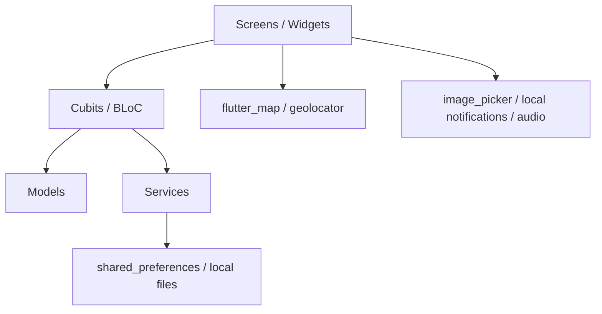

# System architecture

App móvil Flutter con arquitectura simple por capas y estado con Cubits/BLoC. La persistencia actual es local.

## Principio
Preferir mejoras pequeñas y útiles, con feedback visual, antes que reestructuraciones grandes.
